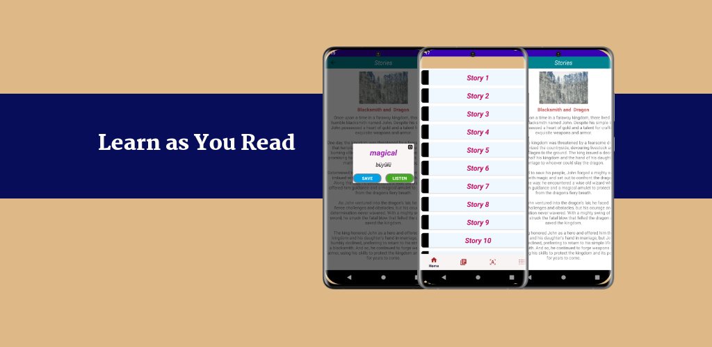

# Learn As You Read
Discover and learn with the Learn as You Read app! 
Explore a variety of stories, save unfamiliar words, and track your learning journey seamlessly. 
The user-friendly interface allows you to quickly save and review new vocabulary while enjoying stories. 
Personalize your experience by uploading your own text using your camera or gallery, and accelerate your learning with tailored content.

## 📚 Key Technologies and Libraries
- Java
- MVVM
- Android Jetpack (Navigation, ViewModel, LiveData)
- ML Kit (Text Recognition, Translation)
- Room for DB
- Dagger Hilt
- RxJava
- CameraX
- UCrop
- Firebase Crashlytics
- Material Components
- XML
- Serialization
- SplashScreen
  
## Installation

## 📸 Screenshots

  

     
     
     
     
     
     
  

## 📸 Video 

